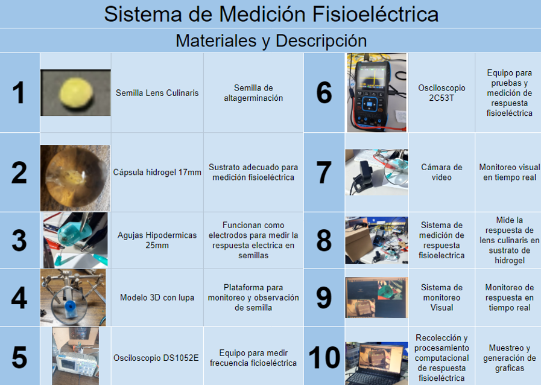

# Adquisición de Señales Eléctricas en Germinación de Lenteja

Este repositorio contiene el archivo `lecturas_oscilloscope.csv`, el cual documenta la adquisición de datos eléctricos capturados durante la germinación de una semilla de lenteja.

## Descripción del experimento

El experimento consistió en registrar la respuesta eléctrica generada por una semilla de **lenteja germinada** colocada en el centro de una **esfera de hidrogel**. Para ello se utilizó un **osciloscopio** configurado para registrar valores de voltaje en **milivoltios (mV)** cada **500 milisegundos**.

El proceso tuvo una duración de varios días y buscó observar la variación en la actividad eléctrica en distintas etapas de la eclosión de la semilla.

<!-- Imagen 1: aquí puedes colocar una fotografía del montaje del experimento o el osciloscopio -->
  
  

<!-- Imagen 2: aquí puedes colocar una gráfica de las señales adquiridas o una visualización del CSV -->

## Estructura del archivo CSV

El archivo `lecturas_oscilloscope.csv` contiene dos columnas principales:

- `Tiempo`: Marca de tiempo en formato `YYYY-MM-DD HH:MM:SS.sss`, correspondiente a cada muestra.
- `Voltaje (mV)`: Valor registrado del voltaje en milivoltios en el instante correspondiente.

Cada fila representa una muestra tomada cada 500 milisegundos durante la duración del experimento.

## Autor

**cMtro. en Ingeniería, Innovación y Tecnología**  
**Lic. Luis Enrique Fuentes Martínez**
